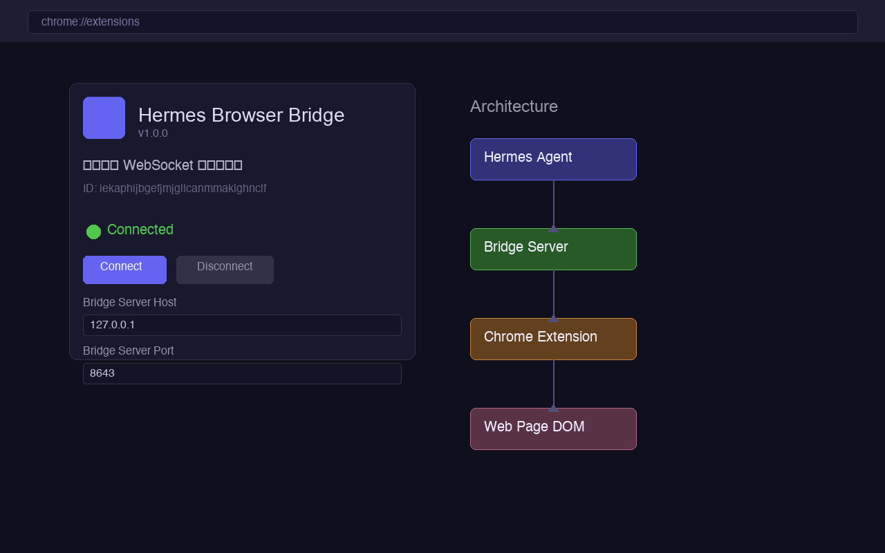
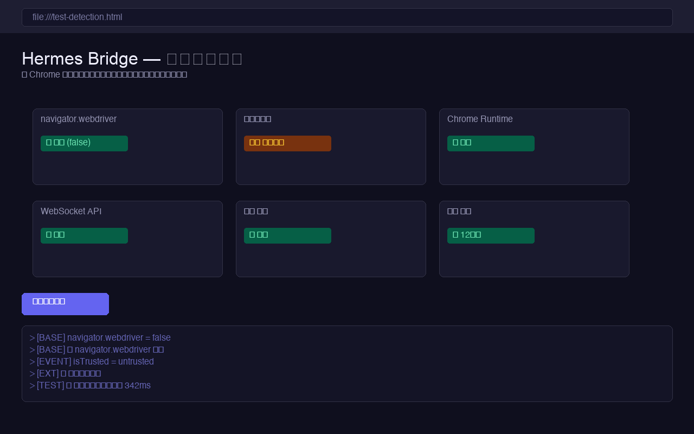

# Hermes AI Assistant

AI chat and browser control in one Chrome side panel.

Hermes AI Assistant is a Manifest V3 Chrome extension that lets users bring their own API key, talk to mainstream LLMs, read the current page, and perform browser actions such as screenshot, navigate, click, scroll, and form filling.

It is designed for people who want something closer to an "AI browser operator" without depending on a developer-owned backend.

## Why This Project Exists

Most browser AI tools do one of two things:

- They only chat about the page, but cannot actually operate it.
- They automate the browser, but hide the model, the data path, or the permissions behind a hosted service.

Hermes takes a different approach:

- Bring your own API key
- Use mainstream models directly from the browser
- Keep settings and profile data local
- Let the side panel both understand and operate the page
- Keep optional agent integration local-only through a Bridge service

## What You Can Do

- Chat with the current page using DeepSeek, OpenAI, Claude, Gemini, Grok, or Kimi
- Read structured page content instead of only raw text
- Take screenshots from the side panel
- Navigate, click, scroll, and fill fields from chat commands
- Paste screenshots or upload files as context
- Auto-fill simple forms using stored profile data
- Connect a local Hermes Agent through an optional Bridge mode

## Product Screens





## Supported Providers

| Provider | Current models in the extension | API style |
| --- | --- | --- |
| DeepSeek | `deepseek-v4-pro`, `deepseek-v4-flash`, `deepseek-chat`, `deepseek-reasoner` | OpenAI-compatible |
| OpenAI | `gpt-5.5`, `gpt-5.4`, `gpt-5.4-mini`, `gpt-5.4-nano` | OpenAI |
| Claude | `claude-opus-4-8`, `claude-sonnet-4-6`, `claude-haiku-4-5-20251001` | Anthropic |
| Gemini | `gemini-3.1-pro-preview`, `gemini-3.5-flash`, `gemini-2.5-pro`, `gemini-2.5-flash` | OpenAI-compatible |
| Grok | `grok-4`, `grok-4.3`, `grok-3`, `grok-3-mini` | OpenAI-compatible |
| Kimi | `kimi-k2.5`, `kimi-k2-thinking`, `kimi-k2-thinking-turbo`, `kimi-k2-turbo-preview`, `kimi-k2-0905-preview` | OpenAI-compatible |

## Core Capabilities

### 1. Multi-model side panel chat

The extension lives in Chrome's right side panel. Users can switch model/provider from the header and keep a single conversation flow while browsing.

### 2. Page reading

Hermes reads the current page and sends structured content to the selected model when the user asks for help. It can preserve headings, forms, and important content blocks better than a simple raw-text dump.

### 3. Browser actions

Hermes supports user-invoked browser actions through the side panel:

- `截图`
- `导航到 https://example.com`
- `点击 #submit`
- `填写 #email user@example.com`
- `向下滚动`
- `读取页面`

### 4. Form assistance

Users can save reusable information such as:

- developer details
- app descriptions
- compliance answers
- custom notes

Then Hermes can scan visible fields on a page and generate an AI-assisted fill plan.

### 5. File and screenshot context

Users can:

- upload text files
- paste screenshots
- upload screenshots directly

This is useful for store review flows, project README-driven form filling, and pages that are easier to explain visually.

### 6. Optional local Bridge mode

Advanced users can connect a local Bridge service so an external Hermes Agent can send browser commands through the extension.

The Bridge is local-only by design.

## Installation

### Option 1: Load unpacked during development

1. Open `chrome://extensions`
2. Enable `Developer mode`
3. Click `Load unpacked`
4. Select this project folder

### Option 2: Use a packaged ZIP

This repository may include packaged ZIP files for review or testing, but the recommended open-source workflow is to load the project unpacked while developing.

## Quick Start

1. Load the extension in Chrome
2. Open the Hermes side panel
3. Go to `Settings`
4. Paste an API key for one provider
5. Open any normal webpage
6. Ask Hermes to summarize, analyze, or interact with the page

Example prompts:

```text
请总结这个页面
帮我提取这页的卖点
截图
导航到 https://github.com
点击 text=Sign in
填写 #email hello@example.com
```

## Local Development

This project does not require a complex build step. The extension is currently plain HTML, CSS, and JavaScript.

Main files:

```text
manifest.json
service-worker.js
content.js
sidepanel/sidepanel.html
sidepanel/sidepanel.js
popup/popup.html
popup/popup.js
bridge-server.py
```

## Architecture

```text
Side Panel UI
  -> provider API calls
  -> service worker browser actions
  -> content script DOM interaction
  -> optional local Bridge service
```

More concretely:

```text
sidepanel/sidepanel.js
  -> AI chat, settings, attachments, provider switching, auto-fill orchestration

service-worker.js
  -> action routing, tab access, screenshots, on-demand content-script injection, Bridge connection

content.js
  -> DOM read, click, fill, select, scroll, structured extraction, form scanning

bridge-server.py
  -> optional local WebSocket bridge for agent integration
```

## Permissions and Privacy

Hermes is intentionally transparent about its permissions.

Permissions currently used:

- `activeTab`
- `tabs`
- `scripting`
- `storage`
- `sidePanel`
- `contextMenus`
- `"<all_urls>"` host permission

Why:

- page reading and interaction need website access
- side panel UI needs `sidePanel`
- on-demand DOM access needs `scripting`
- local settings need `storage`

Important privacy model:

- No developer-owned proxy for model requests
- User API keys stay in Chrome local storage
- Requests go directly from the browser to the chosen provider
- Bridge mode talks only to a local endpoint such as `ws://127.0.0.1:8643`

See:

- [PRIVACY_POLICY.md](./PRIVACY_POLICY.md)
- [docs/privacy-policy.html](./docs/privacy-policy.html)

## Current Limits

- Chrome protected pages such as `chrome://` and some Web Store pages cannot be read like normal webpages
- The extension still uses `"<all_urls>"` because page read/write is a core feature
- Different AI providers have different model naming, rate limits, and authentication rules
- The form auto-fill flow is generic and still benefits from contributor improvements on tricky sites

## Open Source Direction

This repository is being shaped into an open-source browser AI operator project.

Areas where contributions are especially useful:

- better prompt engineering for browser actions
- safer permission minimization
- stronger form understanding
- more resilient DOM targeting
- better UX copy and onboarding
- real-world site compatibility fixes
- tests, docs, and bug reports

See:

- [CONTRIBUTING.md](./CONTRIBUTING.md)
- [ROADMAP.md](./ROADMAP.md)

## Roadmap Snapshot

Near-term priorities:

- improve open-source documentation and contributor workflow
- make page reading and action execution more reliable
- improve structured extraction and fill-plan quality
- reduce permission footprint where possible without breaking the core product
- make Bridge mode easier to set up and test

## Contributing

Contributions are welcome.

If you want to help:

1. Open an issue with the page/site/workflow you want to improve
2. Explain the bug, limitation, or desired UX
3. Submit a focused pull request

Before opening a PR:

- keep changes small and reviewable
- preserve the local-first privacy model
- avoid adding remote proxy services
- document any permission changes clearly

Detailed guide:

- [CONTRIBUTING.md](./CONTRIBUTING.md)

## Repository Docs

Public docs and store-facing materials:

- [docs/index.html](./docs/index.html)
- [docs/privacy-policy.html](./docs/privacy-policy.html)
- [store-submission.md](./store-submission.md)
- [store-privacy.md](./store-privacy.md)

Promotion drafts:

- [PROMOTION/product-hunt-draft.md](./PROMOTION/product-hunt-draft.md)
- [PROMOTION/reddit-posts.md](./PROMOTION/reddit-posts.md)
- [PROMOTION/v2ex-post.md](./PROMOTION/v2ex-post.md)
- [PROMOTION/awesome-list-pr.md](./PROMOTION/awesome-list-pr.md)

## License

This repository is licensed under the MIT License.

See [LICENSE](./LICENSE).
